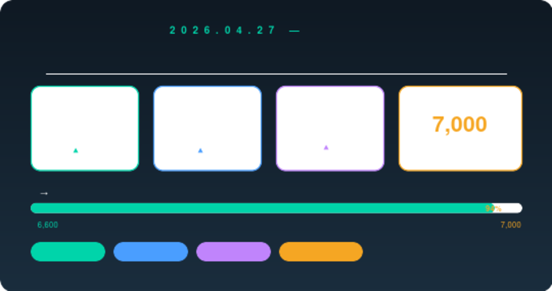
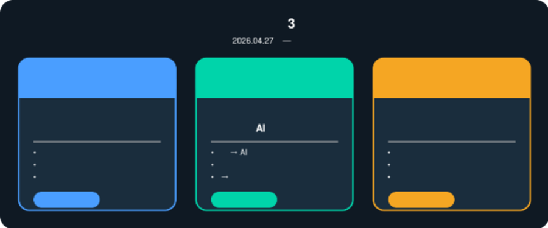
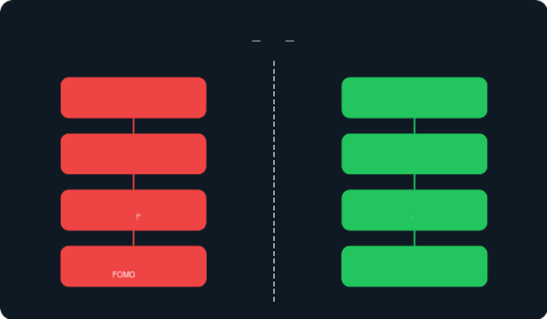
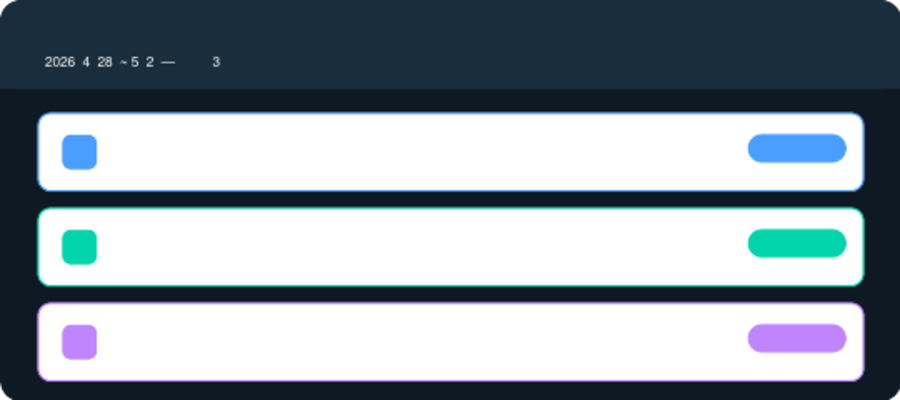

# 코스피 사상 최고치 경신, 코스피 1만 시대 진짜 오나? — 2026년 4월 27일 주식 시장 핵심 요약

> **작성일:** 2026년 4월 27일  
> **출처:** [12시에 만나요] 김경일 교수 · 이광수 · 박시동 · 권다영 출연  
> **태그:** #코스피 #사상최고치 #주식투자 #코스피6600 #내수주 #조선주 #투자심리 #김경일교수

---

## 코스피, 또 다시 역사를 썼다

2026년 4월 27일, 코스피가 **6,600선을 돌파**하며 또 한 번 사상 최고치를 경신했습니다. 코스닥 역시 **1,100선을 넘어서며** 동반 강세를 보였고, 국내 증시 시가총액은 **6,000조 원을 돌파**했습니다.

골드만삭스는 한국 증시의 목표 지수를 **7,000포인트**로 제시했는데, 이조차 '보수적인' 수치라는 분석이 나올 정도로 시장의 기대감이 높아지고 있습니다. 과연 코스피 1만 시대는 현실이 될 수 있을까요?

---

## 지금 시장, 왜 오르고 있나? — 실적 장세의 핵심 구조

단순한 기대감이 아닙니다. 지금의 상승은 **수출 호조 + 내수주 반등**이 동시에 맞물린 **실적 장세**라는 점이 핵심입니다.

### 버핏 지수 고평가 논란, 무시해도 될까?

시장에서는 버핏 지수(시총/GDP)가 고평가 영역에 진입했다는 우려가 나오고 있습니다. 하지만 이광수 애널리스트는 이렇게 말합니다.

> "버핏 지수는 '저량(stock)'의 관점입니다. 지금은 기업 이익이 늘어나는 '유량(flow)' 관점으로 봐야 합니다."

현대백화점을 비롯한 내수주의 상승은 단순한 수급 현상이 아닌, **소비 회복 → 기업 실적 개선 → 경제 선순환**의 신호로 해석해야 한다는 것입니다.

### 조선업, AI 데이터센터 테마까지 품는다

박시동 애널리스트는 **조선업의 새로운 성장 축**에 주목할 것을 권고했습니다. 단순 선박 수주를 넘어 **AI 데이터센터용 엔진 공급**이라는 복합 성장 테마로 진화하고 있다는 점에서, 조선주는 단기 테마가 아닌 중장기 성장주로 재평가받고 있습니다.

---

## 지금 가장 중요한 것 — 투자 심리 관리

시장이 오를수록 투자자의 심리는 더 복잡해집니다. 인지심리학자 **김경일 교수**가 짚어준 핵심 포인트를 정리했습니다.

### "공포는 반응이지, 결정이 아닙니다"

주가가 급락할 때, 우리는 공포를 느낍니다. 문제는 그 공포를 **'결정'으로 착각**한다는 것입니다. 손절하지 못하는 이유도 같은 맥락입니다. 실패를 마주하기 두렵기 때문에 결정 자체를 회피하게 되는 것입니다.

### FOMO와 손실 회피, 인정하는 것이 먼저

인간의 본성인 FOMO(기회를 놓칠 것 같은 공포)와 손실 회피 심리는 없앨 수 없습니다. 김경일 교수는 이것을 **억누르려 하지 말고 인정하면서, 체계적인 심리적 장치를 만들어야 한다**고 강조합니다.

이광수 애널리스트도 같은 맥락에서 원칙을 제시합니다.

> "오르는 주식은 파는 것이 아닙니다. 가격이 아닌 가치에 집중하세요."

### 투자 수명을 길게 보는 것이 핵심

김경일 교수의 마지막 조언은 단순하지만 강력합니다. **"당신의 투자 수명은 생각보다 깁니다."** 지금 이 순간에 집착하지 말고, 긴 호흡으로 심리적 설계를 해야 한다는 것입니다.

---

## 이번 주 놓치면 안 되는 3가지 체크리스트

1. **미국 빅테크 실적 발표 확인 필수** — MS, 아마존 등 주요 실적이 이번 주에 발표됩니다. 글로벌 증시 방향성을 결정할 변수입니다.

2. **불타기 전략으로 평단가 관리** — 오르는 종목에 분할 매수(불타기)를 통해 평단가를 조정하고, 장기 보유 기반을 만드는 전략이 유효합니다.

3. **전력 기기주 수주 잔고 모니터링** — 효성중공업 등 전력 기기 관련주의 수주 잔고와 주주친화 정책 변화를 지속 추적하세요.

---

## 정리 — 실적과 인내, 지금 시장의 두 키워드

| 구분 | 핵심 메시지 |
|------|------------|
| 시장 방향 | 실적 장세 지속, 코스피 7,000 목표 유효 |
| 주목 섹터 | 내수주(현대백화점), 조선주(AI 복합 테마), 전력기기주 |
| 투자 심리 | 공포 = 반응, 결정 아님 / 가치 중심 장기 보유 |
| 이번 주 변수 | 미국 빅테크(MS·아마존) 실적 발표 |

지금 시장은 '오를까, 내릴까'를 맞추는 게임이 아닙니다. **좋은 기업을 골라 감정 없이 보유하는 시스템**을 만드는 것이 진짜 투자입니다.

---

*본 포스팅은 투자 참고용 정보이며 특정 종목에 대한 매수·매도 추천이 아닙니다.*
